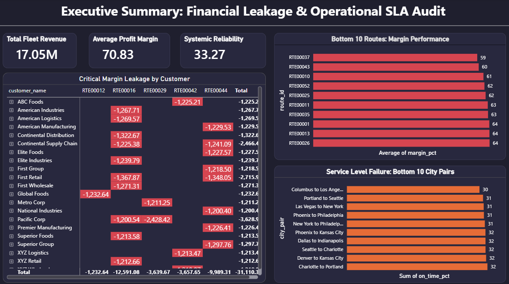
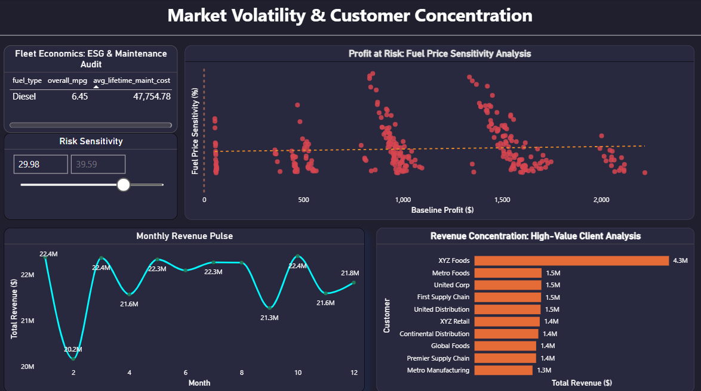
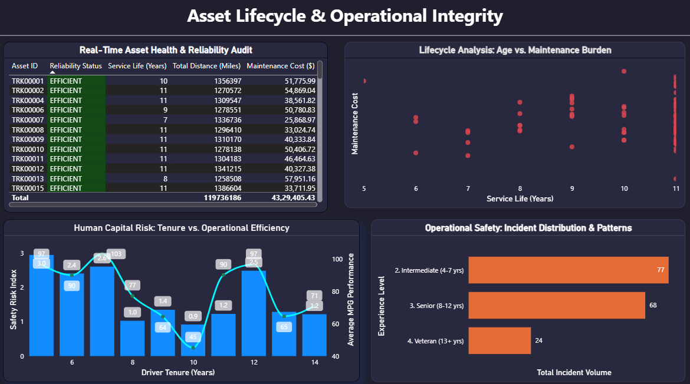

# 🚛 fleet-risk-operations-analysis-sql-powerbi

Analyzing enterprise logistics and fleet operational data using **SQL** and **Power BI** to uncover financial margin leakage, fuel volatility risks, and asset lifecycle insights for real-world transportation decision-making.

---

## 📌 Table of Contents
- [Overview](#overview)  
- [Business Problem](#business-problem)  
- [Dataset](#dataset)  
- [Tools & Technologies](#tools--technologies)  
- [Project Structure](#project-structure)  
- [Data Cleaning & Preparation](#data-cleaning--preparation)  
- [Exploratory Data Analysis (EDA)](#exploratory-data-analysis-eda)  
- [Research Questions & Key Findings](#research-questions--key-findings)  
- [How to Run This Project](#how-to-run-this-project)  
- [Future Enhancements](#future-enhancements)  
- [Author & Contact](#author--contact)  

---

## Overview
This project performs an end-to-end **SQL and Power BI analysis on enterprise fleet data**, focusing on financial health, market volatility, and operational integrity. The goal is to simulate how a Data Analyst builds a "Risk Command Center" to help logistics executives make data-driven decisions on asset retention, client contracts, and driver safety.

---

## Business Problem
Logistics and trucking fleets operate on razor-thin margins. Executive teams need to immediately understand:
- Where **margin leakage** is happening across routes and specific clients.  
- How **fuel price volatility** threatens baseline profitability.  
- When to sell an aging truck before the **maintenance burden** becomes a liability.
- How **driver tenure** impacts fuel efficiency and safety records.  

This project aims to:
- Identify high-risk loads based on fuel **Price Sensitivity (%)**.  
- Detect routes and city-pairs with severe **Service Level Failures**.
- Map the "Sweet Spot" for asset lifecycles (Truck Age vs. Maintenance Cost).
- Visualize human capital risk by correlating driver experience with safety and MPG metrics.

---

## Dataset
- **Source:** Synthetic Enterprise Fleet database (multiple relational tables).   
- **Core Tables:** `asset_health`, `fuel_price_volatility`, `human_risk`, `city_pairs_reliability`.  

Key columns analyzed:
- `truck_id` / `Asset ID` – Primary key for fleet vehicles.
- `route_id` / `city_pair` – Geolocation tracking for margin and SLA analysis.
- `normal_profit` & `risk_sensitivity_pct` – Financial metrics for stress-testing market volatility.
- `truck_age` & `truck_spend` – Variables for lifecycle and maintenance analysis.
- `years_tenure`, `average_mpg`, `safety_risk_index` – Human capital and driver performance metrics.
- `asset_health_status` – Categorical flag for vehicle reliability (e.g., "Efficient", "Warning").

---

## Tools & Technologies
- **SQL / MySQL** – Data extraction, complex joins, and pre-aggregation of risk metrics.
- **Power BI** – Interactive dashboard design, DAX measure creation, and dynamic conditional formatting.
- **GitHub** – Version control and portfolio documentation.

---

## Project Structure
Suggested folder layout for this project:
```text
fleet-risk-operations-analysis-sql-powerbi/
│
├── README.md                      # Project documentation
├── Fleet_Risk_Command_Center.pbix # Final Power BI Dashboard file
│
├── sql_scripts/
│   ├── 01_schema_setup.sql        # Table creation & relationships
│   ├── 02_data_cleaning.sql       # Handling nulls, casting data types
│   ├── 03_risk_aggregations.sql   # SQL views for Power BI ingestion
│   └── 04_ad_hoc_analysis.sql     # Standalone business insight queries
│
└── dataset/                       
    └── raw_csv_files/             # Raw data files used in the project
```

## Data Cleaning & Preparation
Main cleaning and preparation steps performed in SQL & Power Query:
- Standardized currency fields and calculated **Margin Leakage** by finding the delta between projected vs. actual route costs.
- Created **Experience Buckets** in SQL using `CASE` statements to group drivers (e.g., Intermediate, Senior, Veteran) for the safety heatmap.
- Handled millions of rows of maintenance data by pre-aggregating `truck_spend` by `truck_age` to prevent dashboard lag.
- Created DAX measures in Power BI to prevent default "Sum" summarization, ensuring scatter charts plotted individual loads accurately for density heatmaps.

---

## Exploratory Data Analysis (EDA)

Using the clean SQL views, the Power BI dashboard explores three core operational areas:

### 1. Executive Summary
Focuses on financial health, highlighting the bottom 10 routes for margin performance and critical Service Level Agreement (SLA) failures.



---

### 2. Market Volatility
Features a highly dense scatter plot (86k+ data points) visualizing Profit at Risk based on fuel price sensitivity, alongside Revenue Concentration by top clients.



---

### 3. Asset Integrity
Showcases a scatter trend analysis comparing vehicle service life to maintenance burden, utilizing real-time conditional formatting to highlight "Warning" status trucks.


---

## Research Questions & Key Findings
Typical business questions answered by this dashboard:
- **What is our true Market Risk?** Identified the threshold where specific loads cross into critical fuel-price sensitivity (>30%).
- **When should we retire a truck?** The lifecycle analysis visualizes the exact year service costs exponentially outpace operational utility.
- **Does driver retention pay off?** Proved the correlation that higher-tenure drivers directly reduce safety incidents while maximizing fleet MPG.
- **Who are our most dangerous clients?** Highlighted the clients causing the most critical margin leakage, allowing the sales team to renegotiate contracts.

---

## How to Run This Project

1. **Set up the Database (Optional but recommended)**
   - Run the setup scripts in `sql_scripts/01_schema_setup.sql` to build the database.
   - Import the raw CSVs into your SQL environment.
2. **Execute Aggregations**
   - Run the views in `03_risk_aggregations.sql` to prepare the data for visualization.
3. **Open the Dashboard**
   - Open `Fleet_Risk_Command_Center.pbix` in Power BI Desktop.
   - If using local CSVs instead of SQL, ensure the file paths in Power Query Editor point to your local `dataset/` folder.
4. **Interact with the Data**
   - Use the Slicers (e.g., Risk Sensitivity > 30%) to watch the visual heatmaps filter the 86k data points down to critical actionable insights.

---

## Future Enhancements
- Integrate **Python** scripts within Power BI to run predictive Machine Learning models on truck breakdowns.
- Transition the backend from static SQL dumps to a live **Azure SQL Database** for real-time daily operational tracking.
- Add an **Emissions Tracking (ESG)** page to calculate the specific carbon footprint reduction of rotating older diesel assets to EV trucks.

---

## Author & Contact

**Ahmad Reza**  
*Aspiring Data Analyst – SQL & BI*  

- 📧 Email: ahmadreza6122@gmail.com  
- 🔗 LinkedIn: [www.linkedin.com/in/ahmad-reza-econ](https://www.linkedin.com/in/ahmad-reza-econ)  
- 🔗 GitHub:Ah, I completely understand now! My apologies for that mix-up. You want a README built for the **Fleet Management & Risk Dashboard** that we just spent time building together, using that exact same professional layout from your Zepto example. 

Here is the custom GitHub README for your **SQL + Power BI Fleet Risk Project**, highlighting the exact business problems we solved on those three dashboard pages.

***
